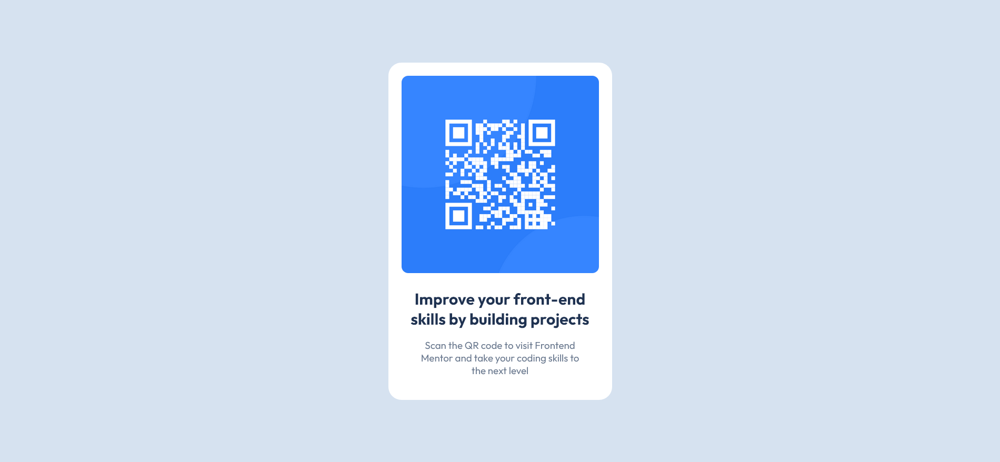
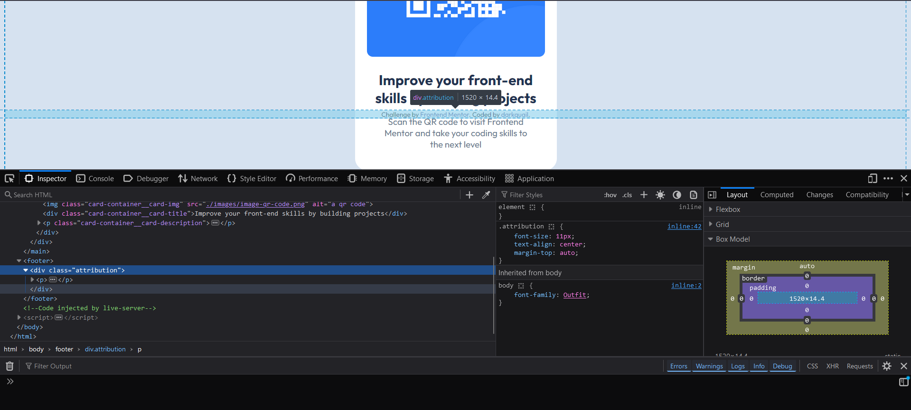

# Frontend Mentor - QR code component solution

This is a solution to the [QR code component challenge on Frontend Mentor](https://www.frontendmentor.io/challenges/qr-code-component-iux_sIO_H). Frontend Mentor challenges help you improve your coding skills by building realistic projects. 

## Table of contents

- [Overview](#overview)
  - [Screenshot](#screenshot)
  - [Links](#links)
- [My process](#my-process)
  - [Built with](#built-with)
  - [What I learned](#what-i-learned)
  - [Useful resources](#useful-resources)
- [Author](#author)

## Overview

### Screenshot

### Links

- Solution URL: [Add solution URL here](https://your-solution-url.com)
- Live Site URL: [Add live site URL here](https://your-live-site-url.com)

## My process
I tried to implement BEM (Block, Element, Modifiers) to make CSS selector become easier to understand and avoid confusion because when the class name is structured to indicate their relationshop and hierarchy i don't need to look up on the HTML element and figure out which one is it and i also found that by adopting this methodology the css codebase looks clean and i can reuse the component that i already write.

For example in this challange i want to group the entire element into one container because i want to use flexbox so i named it `.card-container` and then inside the container i named it `.card-container__card` which mean that the card element is inside the `.card-container` and i just can add `.card-container__card-img` or `.card-container__card-tite` or `.card-container__card-description`and i found that it's become easier to spot rather than using direct element selector such as `p {}` or `img {}` because i need to scroll down again where's the element is it (i just imagine this may noticable when the html scructure is really complex).
### Built with

- Semantic HTML5 markup
- CSS custom properties
- Flexbox

### What I learned

I noticed that when i want to apply `align-items` properties i need to define the `height` properties too, in this case i use `height:100vh` because i want to make sure that the flex container takes up the full height of the viewport, but then footer become overlapping the flexbox container whenever i do inspect element so i use `min-height` instead.

This is because `height:100vh` means it forces the `.card-container` to be the same height as the viewport. This can cause issues if the content inside the container is larger than the viewport, leading to overflow and potentially causing the footer to overlap.

whe i use `min-height: 100vh` the container will be at least the height of the viewport, but it can grow taller if the content inside it requires more space. This prevents overlap by ensuring the container can expand to fit its contents.

### Useful resources

- [Flexbox Cheatsheet](https://css-tricks.com/snippets/css/a-guide-to-flexbox/) - This helped me if i'm start to forget about flexbox capabilities.

## Author

- Website - [darkquail](https://darkquail.github.io/qr-component-challange-solution.html)
- Frontend Mentor - [@MindOfMine](https://www.frontendmentor.io/profile/MindOfMine)

